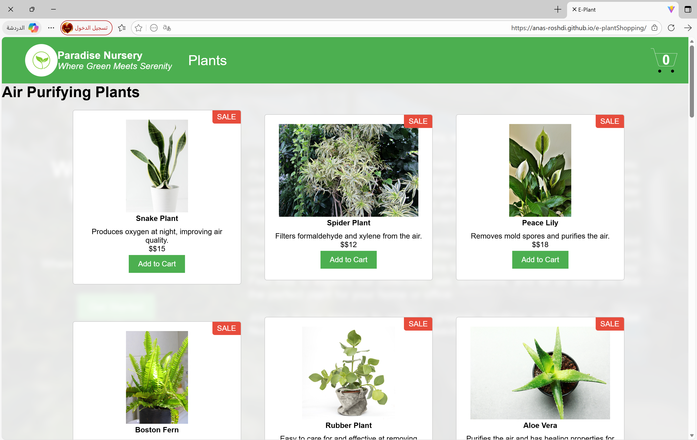
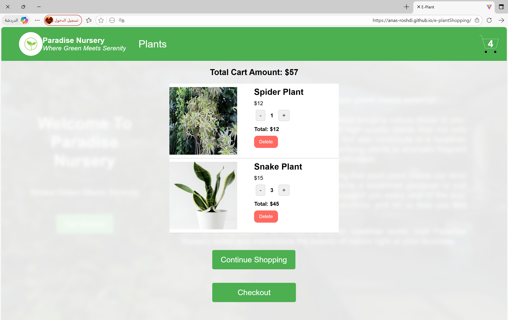

# 🌿 e-plantShopping

A modern, responsive e-commerce web application for purchasing plants. This project demonstrates advanced **React** concepts, state management, and seamless user experience.

## 🔗 Live Demo
**[Click here to view the live website](https://anas-roshdi.github.io/e-plantShopping/)**
## ✨ Features
- **🛒 Dynamic Product Catalog**: Browse a variety of plants with real-time availability.
- **🛍️ Smart Shopping Cart**: Add, remove, and adjust item quantities with instant updates.
- **🧠 State Management**: Robust handling of cart data and global app state using **Redux Toolkit**.
- **💰 Real-time Calculations**: Automatic calculation of total items and costs.

## 🛠️ Tech Stack
- **⚛️ Frontend**: React.js (Hooks, Functional Components)
- **📟 State Management**: Redux Toolkit / Context API
- **🎨 Styling**: CSS3 (Responsive Design)

## 📸 Screenshots
Here is a look at the application interface:

| 🏠 Landing Page | 🛒 Shopping Cart |
| :---: | :---: |
|  |  |

## 🚀 Installation & Setup
1. Clone the repository: `git clone https://github.com/anas-roshdi/e-plantShopping.git`
2. Install dependencies: `npm install`
3. Start the app: `npm start`
